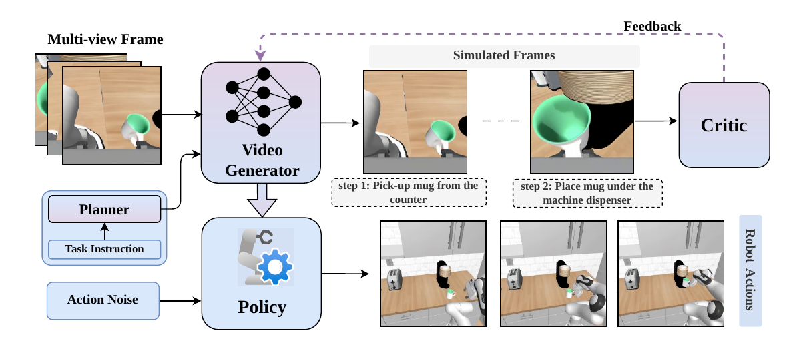

# RoboTALES: Learning Reasoning-Guided Robot Policies via Task-Aligned Simulated Futures

### ECCV 2026
### [Project Page](TODO) | [Paper](TODO) | [arXiv](TODO)

<p align="center">
  <a href="assets/iccv-2026-teaser.pdf"></a>
</p>

## 📖 Overview

Pretrained video generative models are promising backbones for visuomotor control, but their
imagined futures often drift from task intent and are not reliably action-conditional, which makes
them hard to use for planning or action extraction. **RoboTALES** is a **single-stage** framework
that learns *task-aligned* simulated futures and uses them to train robot policies. It introduces
two key ideas:

1. **Hierarchical LLM Planner.** A reasoning LLM decomposes a complex task instruction into an
   ordered sequence of sub-goals that condition the video model's imagination, turning
   undifferentiated prediction into structured, milestone-driven simulation.
2. **VLM-based Critic (reward-guided steering).** A frozen vision-language critic evaluates the
   "imagined" futures against the task instruction and feeds reward-based signal back into the video
   generator's hidden states via **differentiable policy optimization (DDPO)**, keeping the model's
   internal representations focused on the goal.

By anchoring the video generator in abstract reasoning and steering its representations with the
critic, RoboTALES produces temporally consistent rollouts and more coherent actions. Crucially, the
video generator and the action policy are optimized **jointly in a single stage**, so action-level
gradients flow back into the video generator's decoder layers — the world model learns to "imagine
for acting" while the policy learns to "act from imagination."

We evaluate on diverse manipulation tasks from **RoboCasa** and **LIBERO-10**, where RoboTALES
consistently outperforms existing methods, especially on long-horizon tasks (e.g. 48% mean success
on challenging RoboCasa Pick-and-Place, and 64% / 96% on multi-step turning / pressing).

### Method at a glance

RoboTALES couples four components (see Figure 2 in the paper):

| Component | Role | Where in the code |
|---|---|---|
| **LLM Planner** `F_P` | Decomposes instruction `τ` into `K∈[2,5]` sub-goals → augmented plan `C*` | `video_model/videopolicy_planner.py`, `sgm/data/llm_planner.py` |
| **Video Generator** `G_θ` | Stable Video Diffusion backbone; predicts short-horizon future latents conditioned on the plan | `sgm/models/diffusion.py`, `sgm/modules/diffusionmodules/video_model.py` |
| **Reward Critic** `F_R` | Scores imagined rollouts; reward drives DDPO steering of `G_θ`. Selectable via `critic_type`: **LIV** (default) or **LLaVA-1.5 + BERTScore** | dispatch in `sgm/models/diffusion.py`; critics in `sgm/modules/critic_model/llava_critic.py`, `llava_cycle_critic.py` |
| **Action Policy** `π_φ` | 1D action diffusion UNet decoding executable actions from `G_θ` features | `pose_net` in the network config; `sgm/models/diffusion.py` |

## 🗂️ Repository Structure

```
.
├── README.md
├── requirements.txt
├── assets/                     # teaser media
├── packages/                   # simulator deps are cloned here (robomimic/robosuite/robocasa)
├── src/sdata/                  # data pipeline (sdata)
├── video_model/                # ← main RoboCasa code (run all commands from here)
│   ├── main.py                 # training entry point
│   ├── eval_script.py          # aggregates eval results → success rates
│   ├── videopolicy_planner.py  # hierarchical LLM planner
│   ├── configs/                # training configs (single-stage / two-stage / ablations)
│   ├── scripts/sampling/       # inference / evaluation
│   │   ├── robocasa_experiment.py        # closed-loop RoboCasa evaluation
│   │   └── configs/svd_xt*.yaml          # inference configs
│   └── sgm/                     # model library
│       ├── models/
│       │   ├── diffusion.py             # main engine: planner cond. + DDPO VLM-critic steering
│       │   ├── diffusion_sbert.py       # critic variant: SBERT-based reward
│       │   └── diffusion_modified_cycle.py  # critic variant: LLaVA CycleReward
│       └── modules/critic_model/        # VLM critic implementations
└── libero/                     # self-contained LIBERO-10 training/eval release
```

## 🛠️ Installation

Create the environment:
```bash
git clone <REPO_URL>           # TODO: anonymized repo URL
cd robotales
conda create -n robotales python=3.10
conda activate robotales
```

Install the simulation environment (cloned into `packages/`):
```bash
cd packages && \
git clone -b robocasa https://github.com/ARISE-Initiative/robomimic && pip install -e robomimic && \
git clone https://github.com/ARISE-Initiative/robosuite && pip install -e robosuite && \
git clone https://github.com/robocasa/robocasa && pip install -e robocasa && \
python robocasa/robocasa/scripts/download_kitchen_assets.py && \
python robocasa/robocasa/scripts/setup_macros.py
cd ..
```

Install the Python packages:
```bash
pip install -r requirements.txt
```

Tested with **Python 3.10, PyTorch 2.1.0, CUDA 11.8**, and `xformers` for memory-efficient attention.

## 🧾 Checkpoints and Datasets

Pretrained checkpoints and the simulation datasets are **not** included in this repo (see
`video_model/CHECKPOINTS.md` and `video_model/datasets/README.md`).

```bash
# TODO: public download URLs to be released
wget <CHECKPOINTS_URL>   # → place extracted checkpoints/ under video_model/
wget <DATASETS_URL>      # → place extracted datasets/ under video_model/
```

Expected layout:
```
video_model/
├── checkpoints/
└── datasets/v0.1/...
```

## 🧠 LLM Planner

The hierarchical planner calls a **closed-source LLM** — either **Google Gemini** or **OpenAI**.
Bring **your own key** through the environment; **no key is bundled**. The provider is auto-detected
from the model name (`gemini-*` → Gemini, `gpt-*` / `o*` → OpenAI):

```bash
# Gemini (default, e.g. gemini-2.5-pro)
pip install -U google-genai
export GEMINI_API_KEY="<your-gemini-key>"

# — or — OpenAI (e.g. gpt-4o)
pip install -U openai
export OPENAI_API_KEY="<your-openai-key>"
```
Pick the model per config/CLI (e.g. `--model gpt-4o`, or `model="gpt-4o"` in a planner call); pass
`provider="gemini"|"openai"` to override the auto-detection.

**Reproducing without a key.** A **plan cache** ships with the repo
(`video_model/sgm/data/planner_cache.jsonl` for RoboCasa,
`libero/video_model/sgm/data/planner_cache_libero.jsonl` for LIBERO). Plans for the benchmark task
instructions are pre-computed there, so the shipped experiments run **without** an API key — the
planner serves cached plans by instruction lookup. On a cache **miss** with no key set, it raises a
clear error rather than failing silently; set `GEMINI_API_KEY` or `OPENAI_API_KEY` (or add the
instruction to the cache) to plan new tasks.

## 🚀 Training

All training is launched with `main.py` from inside the `video_model/` folder. The general form is:

```bash
PYTHONPATH=. CUDA_VISIBLE_DEVICES=0,1,2,3,4,5,6,7 python main.py \
    --base=configs/<CONFIG>.yaml \
    --name=<RUN_NAME> \
    --seed=24 \
    --num_nodes=1 \
    --wandb=1 \
    lightning.trainer.devices="0,1,2,3,4,5,6,7"
```

Useful flags (see `main.py` for the full list): `--base` (config, required), `--name` (run name),
`--seed`, `--num_nodes`, `--wandb` (`0`/`1`), `--resume` / `--resume_from_checkpoint` (continue a run),
`--logdir` (output dir). Any `key=value` after the flags overrides a config field
(e.g. `lightning.trainer.devices`, `data.params.batch_size`, `model.params.ckpt_path`).

### RoboTALES (single-stage joint training) — main method

This jointly optimizes the planner-conditioned video generator and the action policy, with the
VLM critic steering the world model via DDPO:

```bash
PYTHONPATH=. CUDA_VISIBLE_DEVICES=0,1,2,3,4,5,6,7 python main.py \
    --base=configs/joint_training.yaml --name=robotales --seed=24 --num_nodes=1 --wandb=1 \
    lightning.trainer.devices="0,1,2,3,4,5,6,7"
```

> **Critic choice.** DDPO uses the **LIV** image–language value model as the reward by default. To
> use the **LLaVA-1.5 + BERTScore** VLM critic instead (`sgm/modules/critic_model/llava_critic.py`),
> add `model.params.critic_type=llava` to the command above (slower — it runs a LLaVA generation per
> reward call). The separate `diffusion_sbert.py` (SBERT) and `diffusion_modified_cycle.py` (LLaVA
> CycleReward) engines provide other reward signals via a config's `model.target`.

### Decoupled two-stage training (baseline / ablation)

The paper compares against a decoupled regime where the video generator is trained first and the
action policy is trained afterward on frozen features:

```bash
# Stage 1 — video model (planner + DDPO critic)
PYTHONPATH=. python main.py --base=configs/stage_1_video_model_training.yaml --name=stage1 ...

# Stage 2 — action decoder on the frozen video model
#   (set model.params.ckpt_path to your Stage 1 checkpoint)
PYTHONPATH=. python main.py --base=configs/stage_2_action_decoder_training.yaml --name=stage2 ...
```

### Config reference

| Config | Role |
|---|---|
| `joint_training.yaml` | **RoboTALES single-stage** joint training — main method (RoboCasa) |
| `stage_1_video_model_training.yaml` | Decoupled baseline — stage 1 video model (RoboCasa) |
| `stage_2_action_decoder_training.yaml` | Decoupled baseline — stage 2 action decoder, video model frozen (RoboCasa) |
| `stage_1_video_model_training_libero.yaml` | LIBERO video-model pre-training (see the `libero/` release for joint training) |

> **Hardware.** Training requires GPUs with **80 GB** VRAM.

## 🖥️ Inference / Evaluation

Closed-loop evaluation on RoboCasa is run from the `video_model/` folder:

```bash
CUDA_VISIBLE_DEVICES=0 PYTHONPATH=. python scripts/sampling/robocasa_experiment.py \
    -c scripts/sampling/configs/svd_xt_newckpt.yaml
```

Before running, edit the inference config (`scripts/sampling/configs/svd_xt_newckpt.yaml`):

- **`model.params.ckpt_path`** — your trained RoboTALES checkpoint (the shipped value is a placeholder
  local path and **must** be changed).
- **`log_folder`** — results are written to `experiments/<log_folder>/`.
- **`number_of_experiments`** — demos attempted per launch.
- **`max_traj_len`**, **`action_horizon`**, **`decoding_t`** — rollout length, actions executed per
  step, decoded frames.
- **`data.params.tasks`** — the RoboCasa tasks (24 by default), each with `num_experiments`.

**Multi-GPU.** Each launch claims the next pending task/demo via a file lock on
`experiments/<log_folder>/multi_environment_experiment_record.json`, so you can parallelize by running
the same command on different GPUs:
```bash
CUDA_VISIBLE_DEVICES=0 PYTHONPATH=. python scripts/sampling/robocasa_experiment.py -c scripts/sampling/configs/svd_xt_newckpt.yaml &
CUDA_VISIBLE_DEVICES=1 PYTHONPATH=. python scripts/sampling/robocasa_experiment.py -c scripts/sampling/configs/svd_xt_newckpt.yaml &
# ... one per available GPU
```

### Inference config variants

| Config | Description |
|---|---|
| `svd_xt_newckpt.yaml` | **RoboTALES** — planner + critic (main evaluation) |
| `svd_xt_newckpt_baseline.yaml` | Baseline policy |

### Computing success rates

```bash
python eval_script.py experiments/<log_folder>/multi_environment_experiment_record.json
```

This prints per-task and overall mean success rates from the experiment record.

## 🤖 LIBERO-10

The `libero/` folder is a **self-contained** release for the LIBERO-10 benchmark with its own
`video_model/`, `sgm/`, configs, and scripts. Run everything from `libero/video_model/`:

```bash
cd libero/video_model
```

Closed-loop evaluation imports the **LIBERO benchmark** and the **robosuite fork**, so clone those
separately and add them to `PYTHONPATH` (training does not need them):

```bash
export LIBERO_PP="<path-to>/LIBERO:<path-to>/robosuite_libero"
```

> Checkpoint paths in the shipped configs are placeholders — set `model.params.ckpt_path` (training)
> and the sampling config's `ckpt_path` (evaluation) to your own checkpoints.

### Training (single-stage joint) — main method

As on RoboCasa, the main LIBERO-10 results use **single-stage joint training**: the vision encoder
and the action policy are optimized **together** (video + action loss) with
`stage_2_action_decoder_training.yaml`, initialized from a pre-trained video-model checkpoint.

```bash
# (Prerequisite) pre-train the video model from SVD-XT -> produces the init checkpoint.
PYTHONPATH=. python main.py --base=configs/stage_1_video_model_training.yaml \
    --name=libero_video --seed=24 --wandb=1

# Joint training (main method). Set model.params.ckpt_path to the video checkpoint above.
PYTHONPATH=. python main.py --base=configs/stage_2_action_decoder_training.yaml \
    --name=libero_joint --seed=24 --wandb=1
```

| Config | Role |
|---|---|
| `stage_2_action_decoder_training.yaml` | **Joint training — main method** (vision encoder + action policy, `diffusion.py`) |
| `stage_1_video_model_training.yaml` | Video-model pre-training that produces the init checkpoint |

### Evaluation

**Baseline (no planner)** — `libero_experiment.py` on a LIBERO task suite:

```bash
CUDA_VISIBLE_DEVICES=0 PYTHONPATH="$LIBERO_PP:." \
    python scripts/sampling/libero_experiment.py \
    --config=scripts/sampling/configs/svd_xt_libero_90_original.yaml
```

**RoboTALES (planner-conditioned)** — `libero_planner.py` with `--use_planner`:

```bash
CUDA_VISIBLE_DEVICES=0 PYTHONPATH="$LIBERO_PP:." \
    python scripts/sampling/libero_planner.py \
    --config=scripts/sampling/configs/svd_xt_modified.yaml --use_planner
```

**Multi-GPU splits.** Two helper scripts fan the tasks across GPUs (they auto-generate the per-GPU
split configs). Export `LIBERO_PP` (as above) so the scripts find your `LIBERO` / `robosuite_libero`
clones:

```bash
# Baseline: LIBERO-90 split across 4 GPUs (default 3 4 5 6)
bash scripts/sampling/run_libero_original_split4.sh [GPU_A GPU_B GPU_C GPU_D]

# Planner: split across 2 GPUs (default 4 5)
bash scripts/sampling/run_libero_planner_split.sh [GPU_A GPU_B]
```

Per-task rollouts and success results are written under `experiments/<log_folder>/`.

## 🙏 Acknowledgement

<!-- This repository builds on [Stable Video Diffusion / generative-models](https://github.com/Stability-AI/generative-models)
and the `sdata` data pipeline. We thank the authors for publicly releasing their code. -->

## 📚 Citation

<!-- ```bibtex
@inproceedings{robotales2026,
  title     = {RoboTALES: Learning Reasoning-Guided Robot Policies via Task-Aligned Simulated Futures},
  author    = {Anonymous ECCV 2026 Submission},
  booktitle = {European Conference on Computer Vision (ECCV)},
  year      = {2026}
}
``` -->
